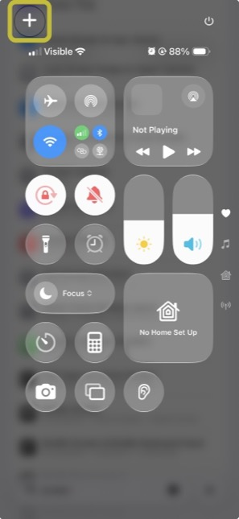
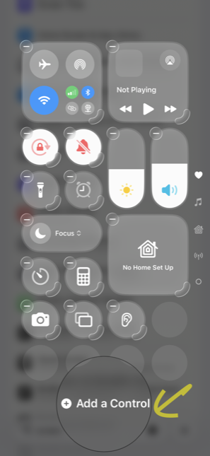
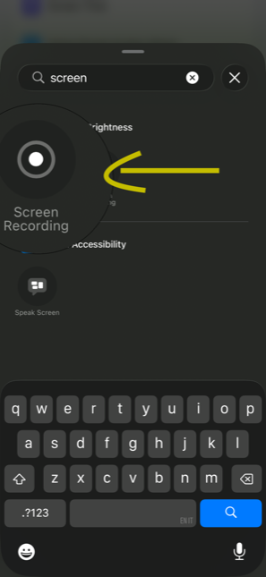
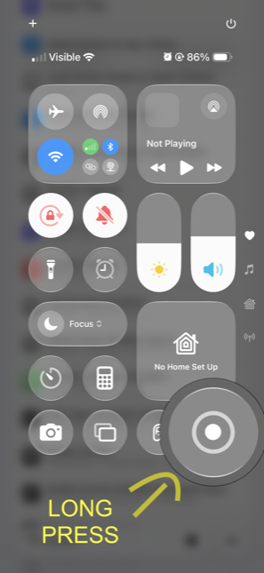
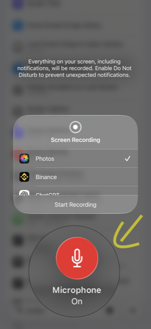
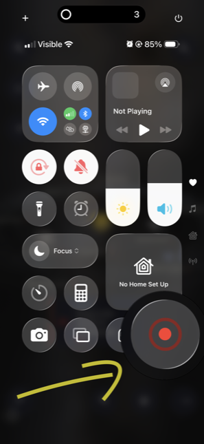

# talkthru

**[talkthru.dev](https://talkthru.dev)** · [npm](https://www.npmjs.com/package/talkthru) · MIT

Talk while you use your app. Your coding agent sees what you saw and hears what you meant.

No more screenshot → crop → draw an arrow → type "the spacing at the top is off". You record your screen, say what's wrong out loud, and drop the file on your Mac. Claude Code reads it back as screens plus your words, lined up.

```
you:    *taps around* "this quest card sits on top of the sun, it washes out"

Claude: reads the frame where that happened, sees the card and the glow behind it,
        and fixes the right component.
```

Everything runs on your machine. No accounts, no uploads, no API keys.

Tested on macOS with an iPhone. Anything that produces a video with sound should work — point the watcher at a folder.

---

## Setup

Once, about two minutes.

**1. Install**

```bash
npx talkthru doctor --fix
```

That installs `ffmpeg` and `whisper.cpp` through Homebrew if you don't have them, then
downloads the speech model. Both are native binaries, not npm packages — vendoring them
would add ~100 MB to the install and give up the hardware acceleration (Metal, on Apple
silicon) that makes transcription faster than real time.

**2. Tell Claude Code about it**

```bash
claude mcp add --scope user talkthru -- npx talkthru-mcp
```

Restart any Claude Code session that's already open — it only picks up new servers on startup. Type `/mcp` and you should see `talkthru` in the list.

**3. Turn on screen recording on your phone**

Open Control Centre (swipe down from the top-right) and tap **+** → **Add a Control** →
search *screen* → **Screen Recording**. Then press and hold the new ◉ button and switch
the **Microphone on**. It sticks — you only do this once.

<table>
<tr>
<td width="33%"></td>
<td width="33%"></td>
<td width="33%"></td>
</tr>
<tr>
<td><b>1.</b> tap <b>+</b></td>
<td><b>2.</b> Add a Control</td>
<td><b>3.</b> pick Screen Recording</td>
</tr>
<tr>
<td></td>
<td></td>
<td></td>
</tr>
<tr>
<td><b>4.</b> press and hold ◉</td>
<td><b>5.</b> Microphone <b>On</b></td>
<td><b>6.</b> tap ◉ and talk</td>
</tr>
</table>

---

## Using it

Start the watcher and leave it running:

```bash
talkthru watch
```

It only touches files that look like screen recordings. The rest of your Downloads folder is invisible to it.

Then, whenever you want to give feedback:

1. Hit record on your phone, use your app, say what you think as you go
2. Stop, AirDrop the video to your Mac
3. In Claude Code: **"check the feedback in my last talkthru session and implement it"**

Processing takes about twenty seconds while you switch windows. The original video moves to `~/.talkthru/archive/` — it is never deleted.

**One tip that matters:** if your app talks — text to speech, narration, sound effects with speech — mute it before recording. Otherwise your app's voice and yours end up in the same track and whisper can't tell you apart.

---

## What you get

A markdown file your agent reads, with your narration attached to the screen that was on at the time:

```markdown
## 00:34 · f11 — `frames/f11.jpg`
- [00:39] "the settings here is a bit off, you have to scroll down
           instead of scrolling the whole sheet"
```

Plus the frames themselves. A 107-second session came out at about 600 tokens.

---

## Commands

```bash
talkthru watch                  # watch ~/Downloads for screen recordings
talkthru watch ~/some-folder    # watch a folder of your own, any video
talkthru process video.mp4      # process one file by hand
talkthru list                   # recent sessions
talkthru show latest            # read one in the terminal
talkthru doctor                 # what's missing
talkthru prune                  # delete old sessions
```

`tt` is a shorthand for `talkthru`.

---

## How it works

`ffmpeg` finds the moments your screen actually changed and pulls those frames. Speech regions come from real silence in the audio, and `whisper.cpp` transcribes each one locally — so a sentence lands on the screen you were looking at when you said it, not on whatever appeared mid-sentence. An MCP server hands the result to Claude Code.

Node 20.11+, `ffmpeg` and `whisper.cpp`.

MIT.
